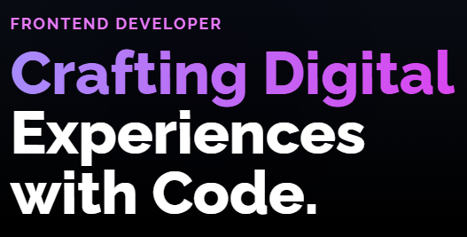

# ✨ Developer Portfolio

<div align="center">
  
</div>

<br />

## 🌟 Overview

A modern, responsive portfolio website showcasing my work as a frontend developer. Built with React and styled with Tailwind CSS to create a visually stunning experience.

> "Crafting Digital Experiences with Code."

This portfolio transforms ideas into functional, scalable web applications with a focus on intuitive user interfaces and robust backend integration.

## ✨ Features

- 🎨 **Modern Design** - Beautiful gradients and animations create an engaging experience
- 📱 **Fully Responsive** - Perfect viewing on all devices from mobile to desktop
- 🚀 **Performance Optimized** - Fast loading times and smooth animations
- 🧩 **Component-Based** - Modular architecture for easy maintenance
- 💼 **Project Showcase** - Highlight my best work with detailed descriptions
- 📝 **Contact Form** - Easy way for visitors to reach out

## 🛠️ Tech Stack

- **React** - Component-based UI library
- **TailwindCSS** - Utility-first CSS framework
- **React Icons** - Beautiful icon integration
- **React Scroll** - Smooth scrolling navigation
- **Custom Animations** - Engaging visual effects

## 🚀 Quick Start

```bash
# Clone the repository
git clone myportfolio

# Navigate to the directory
cd myportfolio

# Install dependencies
npm install

# Start development server
npm run dev
```

## 📷 Visual Experience

The site features a stunning hero section with:

- Animated gradient background elements that create depth
- Modern typography with gradient text effects
- Smooth hover animations on interactive elements
- Professional styling that highlights content without overwhelming

## 📱 Connect With Me

<div align="center">
  <a href="https://github.com/suraj-shrivastav" target="_blank">
    
  </a>
  <a href="https://linkedin.com/in/suraj-shrivastav" target="_blank">
    
  </a>
</div>

<br />

---

<div align="center">
  <sub>
    Built with 
    <span style="font-weight: bold;">❤️</span> 
    by Suraj (and a few 
    <span style="font-weight: bold; color: #3498db;">AI overlords</span> 
    who occasionally let me touch the keyboard😂)
  </sub>
</div>
